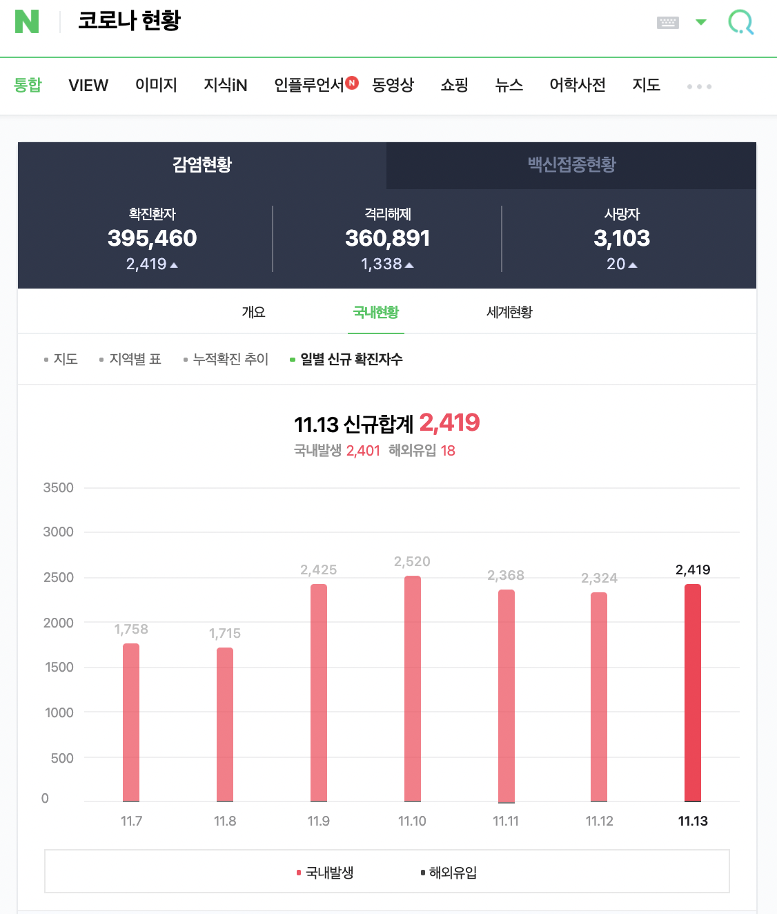

# covid19-analysis-and-visualization

 
---
## Contents
### 1. 최근 일주일간 코로나 발생 관련 분석
* 01_최근_7일_코로나현황  
* 02_7일_신규_확진자수_시각화
### 2. 지역 관련 코로나 분석
* 03_지역별_코로나_현황
* 04_지역별_데이터_분석
  
          
          
## 최근 일주일간 코로나 발생 관련 분석  
  
### 크롤링할 window

### dataframe 화

2. 7일_신규_확진자수_시각화
#### 실행장면

## 지역 관련 코로나 분석  
1. 지역별_코로나_현황
#### 실행장면

2. 지역별_데이터_분석
#### 실행장면

## 정보

[깃허브주소](https://github.com/jinokiim) – wlsghrla94@gmail.com
